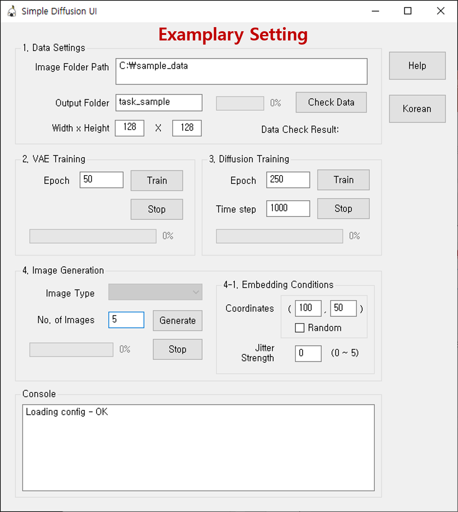

**Demo video**: https://m.youtube.com/watch?v=LiBIpscLjtQ  


## Train and Generate Diffusion (DDPM) with your customized Dataset.  
**Forked from**: https://github.com/explainingai-code/StableDiffusion-PyTorch  
**Caution**: The network structure is modified from the original stable diffusion for customized dataset.  
             Thus you have to prepare your own dataset and train from zero.

## Main features
- Training VQVAE for AutoEncoder.  
- Training DDPM for Image Generation.  
- Generating Images with predefined Embeddings.  


# Setup

### Install Python (version 3.9 or higher)
   - Access URL and download the python install file  https://www.python.org/downloads/release/python-3920/
   - It is recommended to install Python in an easily accessible path (e.g., D:\python\python39)
   - Remember the [Python installation path]

### Create a Virtual Environment
   - Install Python 3.9 version
   - Install virtualenv and create a virtual environment
     ```
     pip install virtualenv
     virtualenv venv --python=[Python installation path]\Scripts\python.exe
     ```
     <br>
   - A folder named venv will be created in the current directory
   - Run the run_venv.bat file; if a command prompt starting with (venv) appears, the setup is successful

### Virtual Environment Setup
   - **torch**
     - Access URL: https://download.pytorch.org/whl/torch/
     - Download torch-1.11.0%2Bcu115-cp39-cp39-win_amd64.whl file (recommended: default download folder)
   - **torchvision**
     - Access URL: https://download.pytorch.org/whl/torchvision/
     - Download torchvision-0.12.0%2Bcu115-cp39-cp39-win_amd64.whl file (recommended: default download folder)
   - Once the torch and torchvision files are downloaded, install the required packages  
     ```
     pip install -r requirements.txt
     pip install torch-1.11.0+cu115-cp39-cp39-win_amd64.whl
     pip install torchvision-0.12.0+cu115-cp39-cp39-win_amd64
     ```
     <br>
   - **tokenizer**
     - Access URL: https://huggingface.co/openai/clip-vit-base-patch16/tree/main
     - Click the Files tab next to Model card
     - Download all files to the openai/clip-vit-base-patch16 folder


# Prepare Sample Data
### If you want to test with sample data, follow the steps below.

 - Run ```make_generic_data.py``` script to create generic data
 - Once the execution is successful, 'img' and 'caption' folders will be created with 10000 data included
 - In '**img**' folder, cropped image files are saved
 - In '**caption**' folder, text files are saved with embedding information of x, y coordinates where each image was cropped, and the shape of the center figure
 - A sample image data looks like this  
   ```
   (236, 134), star
   ```
    

 - **Caution**: The filename of each **img** and **caption** data must be matched
 - The images are downloaded from Pixabay, and modifed  
 https://pixabay.com/vectors/ai-generated-circuit-pattern-9104308/  
 https://pixabay.com/vectors/pattern-floral-yellow-green-7842948/  


# Train and Generate Images
### Run the UI script
 - Navigate to the folder git-cloned
 - Run sd_ui.py script
   ```
   python -m UI.sd_ui
   ```
 - UI will pop-up  
 - Fill the information for training. Below is an examplary screenshot  
   

### 1. Check the image data
  - Click '**Check Data**' button to check validity of the data folder you prepared
  - 'OK' will be printed if the data folder is valid, and 'Fail' if not
  - If '**Check Data**' result is OK, '**Image Type**' combobox in '**4. Image Generation**'  will be updated  
  - Training results and model files are saved in '**Output Folder**'  

### 2. Training VQVAE  
  - Click '**Train**' button in '**2. VAE Training**'
  - Click '**Stop**' button whenever you want to stop the training
  - Once the training is completed, VQVAE model files will be saved  
    . vqvae_autoencoder_ckpt.pth
    . vqvae_discriminator_ckpt.pth
  - During the training, you can peek the performance of the autoencoder from the picture files in '**vqvae_autoencoder_samples**' folder

  
### 3. Training DDPM
  - Click '**Train**' button in '**3. Diffusion Training**'
  - Click '**Stop**' button whenever you want to stop the training
  - Model files will be saved every 10 epochs  
  - Once the training is completed, DDPM model files will be saved  
    . ddpm_ckpt_text_cond_clip.pth  

### 4. Generate Images
  - Select '**Image Type**'  
  - Enter x, y coordinates in '**4-1. Embedding Conditions**'  
  - You can give some randomness to the enterred coordinates by the value of '**Jitter Strength**'  
  - Check '**Random**' if you want to generate images from random location. It will select random coordinates in the range of the values of text files in caption folder  
  - Click '**Generate**' button to generate images  
  - The generated images are saved in '**cond_text_samples**' folder  
  
